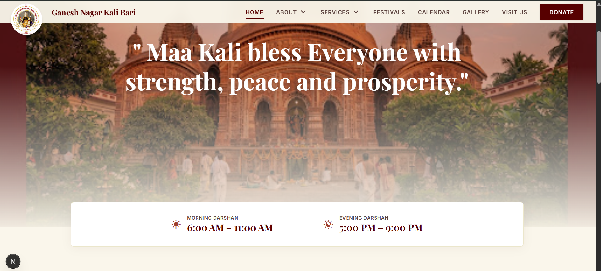

# 🛕 Ganesh Nagar Kali Bari

> A modern, responsive digital presence for **Ganesh Nagar Kali Bari**, designed to bring the temple's heritage, festivals, services, community activities, and visitor information together in one accessible platform.

---

## ✨ Overview

**Ganesh Nagar Kali Bari** is a modern web platform created to establish a professional digital presence for the temple and its community.

The website organizes important information such as the temple's history, festivals, services, gallery, calendar, donation information, and visitor details into a clean and accessible experience.

Rather than building a generic demo website, this project focuses on solving a **real-world communication problem** — making community and temple information easier to discover, understand, and access online.

---

## 🎯 Project Goals

- Establish a professional online presence for the temple
- Preserve and present the temple's history and heritage
- Provide accessible festival and calendar information
- Explain available religious and community services
- Showcase temple and event photography
- Provide clear donation-related information
- Help visitors find map location and visiting instruction
- Deliver a responsive experience across desktop and mobile devices

---

## 🎥 Project Preview

  

---

## 🚀 Key Features

### 🏠 Informative Home Page:

A welcoming landing page designed to provide visitors with essential information and guide them toward the most important sections of the website.

### 📖 Temple History

A dedicated historical section presenting the temple's background and development through a structured timeline.

### 🪔 Festivals

A dedicated festival section highlighting important celebrations and cultural events associated with the temple.

### 📅 Community Calendar

A centralized space for presenting important dates, religious occasions, and community events.

### 🙏 Services & Seva

A structured presentation of temple services and available seva-related information.

### 🖼️ Gallery

A visual gallery for showcasing temple activities, festivals, celebrations, and community moments.

### 💝 Donation Information

A dedicated donation section designed to make contribution-related information easier for devotees to understand.

### 📍 Visit Us

A dedicated visitor-information page containing essential information for people planning a visit.

### 🧩 Reusable UI Components

The project uses reusable components for recurring interface patterns such as:

- Navigation
- Footer
- Timeline
- Bento Grid
- Donation Form
- UI primitives

This keeps the application easier to maintain and extend.

---

## 🛠️ Tech Stack

| Technology       | Purpose                                      |
| ---------------- | -------------------------------------------- | --- |
| **Next.js**      | React framework and application architecture |
| **TypeScript**   | Type-safe development                        |
| **Tailwind CSS** | Responsive UI styling                        |
| **React**        | Component-based UI development               |
| **ESLint**       | Code quality and consistency                 |     |
| **Git & GitHub** | Version control and project management       |

---

## 📱 Responsive Design

The application is designed to provide a consistent experience across:

- 💻 Desktop
- 💻 Laptop
- 📱 Mobile
- 📟 Tablet

Layouts and components are built with responsive behavior in mind so that important temple information remains accessible across different screen sizes.

---

## 🔮 Future Improvements

Potential future iterations include:

- [ ] Online donation/payment integration
- [ ] Dynamic event management
- [ ] Admin dashboard for content updates
- [ ] Multilingual support
- [ ] Temple announcements and notifications
- [ ] Volunteer/community registration
- [ ] Social media integration
- [ ] SEO enhancements
- [ ] Accessibility improvements
- [ ] Performance monitoring and optimization
- [ ] Deployment with a custom domain

---

## 🌐 Deployment

The project can be deployed using modern Next.js-compatible hosting platforms such as:

- Vercel
- Netlify
- Self-hosted infrastructure

For production deployment, environment-specific configuration and domain setup should be added according to the hosting provider.

---

## 🤝 Contribution

This project is primarily developed for **Ganesh Nagar Kali Bari**.

Suggestions, improvements, and constructive feedback are welcome.

## If you discover an issue or have an improvement proposal, feel free to open an issue or submit a pull request.

## 👨‍💻 Developer: **Shounak Pal**
